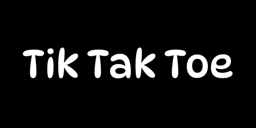

  

<h3>Descrição</h3>

    Tik Tak Toe é um aplicativo de jogo da velha com uma mecânica inovadora: cada jogador pode usar apenas 3 casas no tabuleiro. Ao tentar marcar a 4ª casa, a jogada mais antiga do jogador é automaticamente removida. Essa dinâmica evita que o jogo termine em empate (dar velha), mantendo a partida sempre ativa e estratégica!

<h3>O jogo</h3>
<video src="./assets/readme/video.mp4" controls width="200"></video>
<h3>Download</h3>
<a href="./assets/readme/tiktaktoe.apk" download>
    <strong>
        
Baixar APK

    </strong>
</a>
<h3>Licença</h3>

Creative Commons NonCommercial

<h3>Author</h3>
<a src="https://www.linkedin.com/in/rafa-couto/"> 
    
Rafael Couto Silva

</a>
